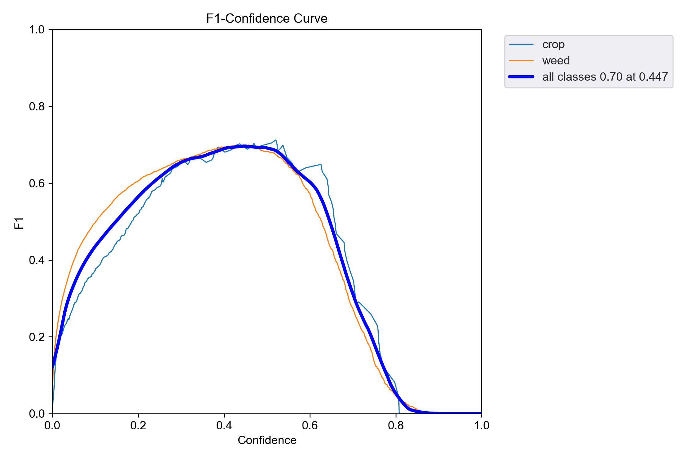
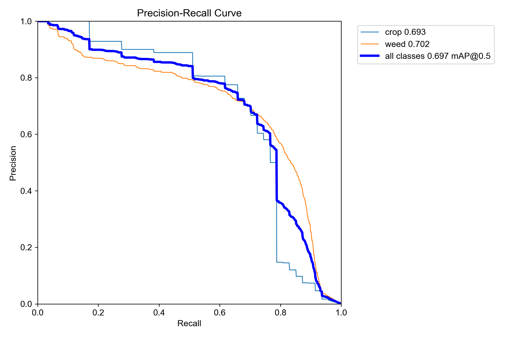
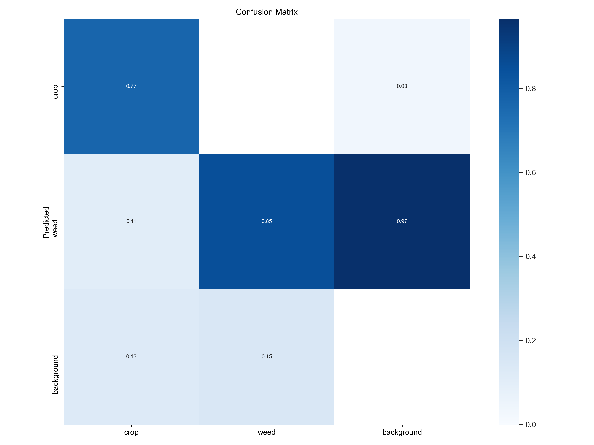
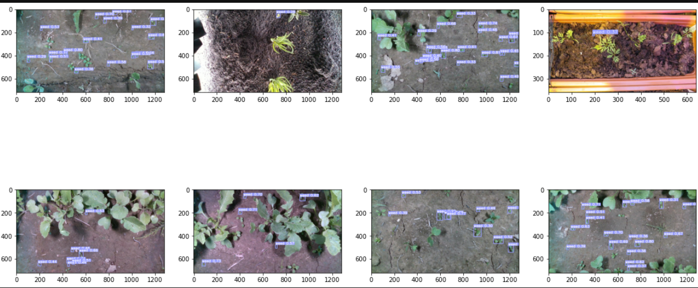

# Weeds detection using yolo object detection algorithm
Weeds can cause a lot of damage to the agricultural industry and water control, and weed detection can be a tedious task. In this project, I tried to detect weeds using the YOLO algorithm.

# Metrices :
    

# Result :

 
